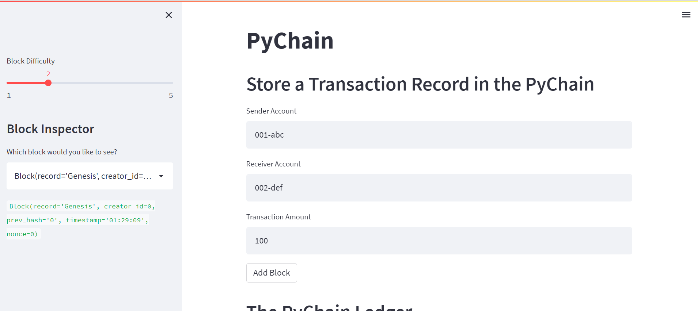
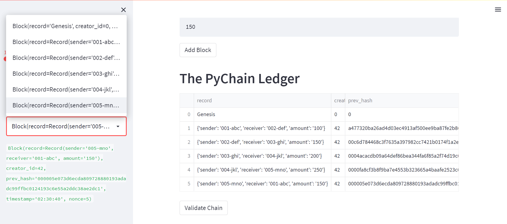
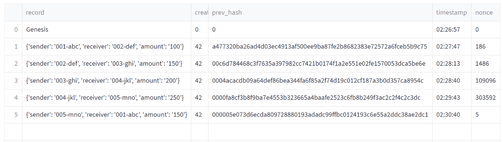
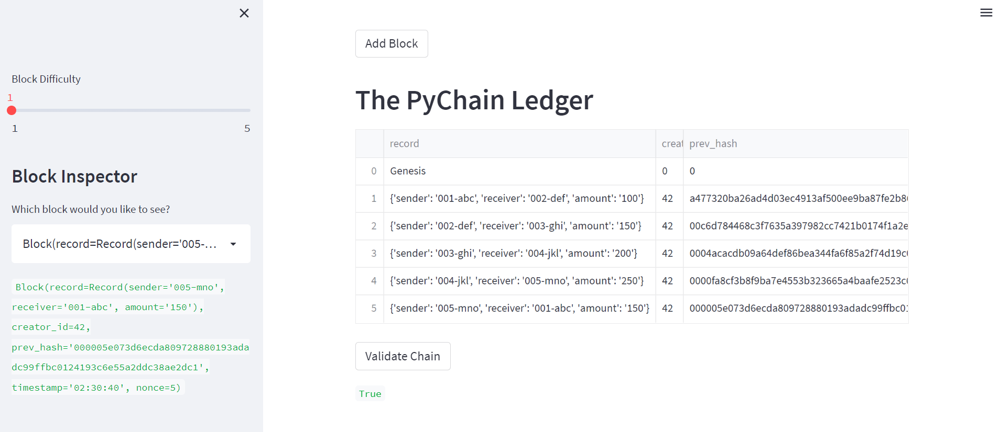
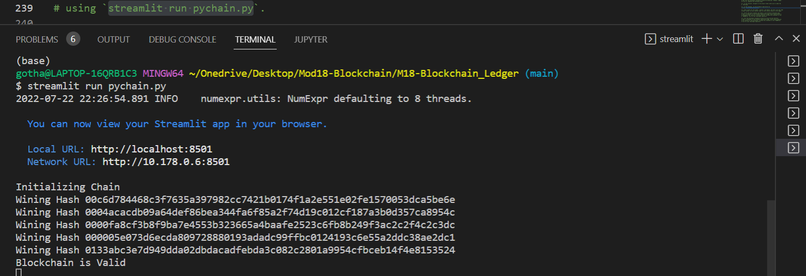

# M18-Blockchain_Ledger

  

*"Developing a Blockchain ledger that verifies financial transaction data with counterparty financial institutions."* 


## Background 

A fintech engineer working at one of the five largest banks in the world is recently promoted to act as the lead developer on the decentralized finance team. The task is to build a blockchain-based ledger system, complete with a user-friendly web interface. The ledger should allow partner banks to conduct financial transactions and to verify the integrity of the data in the ledger.  

---

## Evaluation Results

The following illustrations describes utilization of the streamlit app to tests the blockchain ledgers storage of records and verification. 

* The web based GUI of the steamlit app for 'Sender', 'Receiver' and 'Amount' inputs with 'Add Block and "Validation' buttons to activate the blockchain ledger process:
 
--

* A) 4. Verify the block contents and hashes in the Streamlit drop-down menu. Take a screenshot of the Streamlit application page, which should detail a blockchain that consists of multiple blocks. Include the screenshot in the README.md file for your Challenge repository: 
  


--
  
* B) 5. Test the blockchain validation process by using the web interface. Take a screenshot of the Streamlit application page, which should indicate the validity of the blockchain:


 

___
---
## Technologies

The software operates on python 3.9 with the installation package imports embedded with Anaconda3 installation. The application was developed in VSCode 1.69.2, using the python 3.10 language and Streamlit v1.10.0. Below are installation sites and libraries for imported tools to run the program.  The application for GUI uses Streamlit to create and run the blockchain ledger, and validate it. 


---

## Installation Guide

Before running the applications open your terminal to install and check for the installations: First navigate to the websites using the links below and follow the download instructions or use the pip installs from the python libraries below. Then verify if the installations have been completed. 

1. Install Anaconda and create your environment; `python` should be installed with Anaconda:
* [anaconda3](https://docs.anaconda.com/anaconda/install/windows/e) 

2. Verify version in the terminal enter command `python` for information or download:
* [python](https://www.python.org/downloads/)

3. Install Visual Studio Code, or VS Code, IDE to write the program & run it in Streamlit app: 
* [VSCode](https://code.visualstudio.com/download) 

4. Install Streamlit to run the python code for the Blockchain Ledger in a GUI as a shareable web app: 
* [streamlit](https://docs.streamlit.io/library/get-started/installation)


```
python libraries
pip install streamlit                         # Python library for building web interfaces for Python apps.
```
```
import pandas as pd
import streamlit as st                        # Python library for building web interfaces for Python apps 
from dataclasses import dataclass             # tells Python what kind of data to store in the data class
from typing import Any, List                  # allows versatility to change the type of data in the block  
import datetime as datetime                   # Python date/time stamp: %hrs, %mins, and %secs. 
import hashlib                                # provides access to cryptography functions to validate block data
```
___
---
# Usage

This application is launched from the VSCode terminal utilizing the above imported Python libraries and tools.  The program is developed in VSCode using python language **.py** file to build the Blockchain ledger for transaction verification of the data in the ledger. The user of the program application operates through the Streamlit web app that provides functionality to create blocks, perform the proof of work consensus protocol, and validate blocks in the chain.     

To run the Streamlit application, open a new terminal and navigate to the directory that contains our `pychain.py` file, and then run the following command `streamlit run app.py`.
 
A Streamlit video of testing the blockchain validation process is demonstatrated in 
[Streamlit Screencast Video](Images/M18streamlit-pychain-2022-07-22-23-07-49.webm). Please locate `M18streamlit-pychain-2022-07-22-23-07-49.webm` video file in the Images folder and run it if the former link doesn't function. 


```
python
pychain.py
```
 
___
---
## Contributors

*Provided to you by digi-Borg FinTek*, 
Dana Hayes: nydane1@gmail.com

---

## License 

--

Columbia U. Engineering 

--

[BSD 2-Clause LicenseCopyright (c) 2022, digi-Borg
All rights reserved.](/LICENSE)

