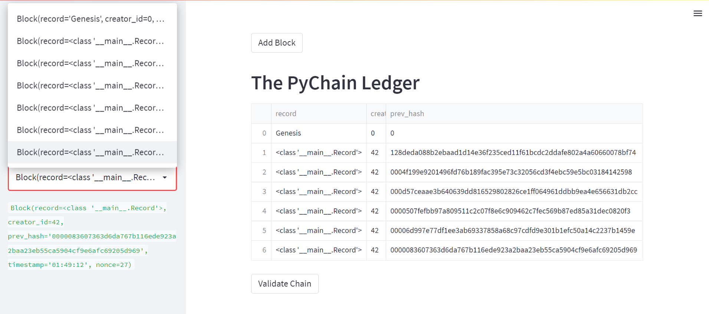
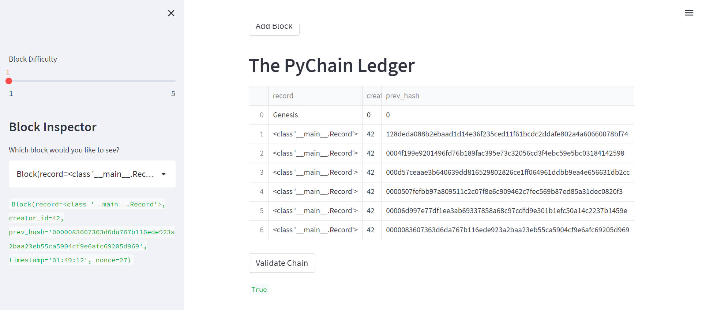

# M18-Blockchain_Ledger

  

*"Developing a Blockchain ledger for financial transactions with counterparty financial institutions for data verification."* 


## Background 

A fintech engineer working at one of the five largest banks in the world is recently promoted to act as the lead developer on the decentralized finance team. The task is to build a blockchain-based ledger system, complete with a user-friendly web interface. The ledger should allow partner banks to conduct financial transactions and to verify the integrity of the data in the ledger.

The FinTech technology in this program utilizes ScikitLearn ML algorithm software tools. The tools are used to build algorithmic models by adjusting inputs for buy, sell or hold signals; these signals are derived from a technical indicator called simple moving average(SMA). SMA's calculate the average stock prices over a rolling time period designating a number of days in time windows. 

Adjusting the ML algorithm inputs one can put together models, tune them, visualize performance on charts, and backtest them for evaluation on a Classification Report. Additionaly, other classes of ML models are available for backtesting and predicting outcomes before applying them to your strategies.  

---

## Evaluation Results

The following illustrations describes the utilizing the streamlit app to tests the blockchain ledgers storage of records. To analyze and conclude each model’s performance it's Cumulative Returns chart is visualized and Classifier Report are evaluated. The first 4 models are baseline set at 3 month time with SMA short-window @4days and long-window @100days for initial comparison.

* A) 4. Verify the block contents and hashes in the Streamlit drop-down menu. Take a screenshot of the Streamlit application page, which should detail a blockchain that consists of multiple blocks. Include the screenshot in the README.md file for your Challenge repository: 
    
  
* B) Test the blockchain validation process by using the web interface. Take a screenshot of the Streamlit application page, which should indicate the validity of the blockchain:
 

* 3) Streamlit video of testing the blockchain validation process by using the PyChain ledger:
 

* 4) DecisionTreeClassifier Model Results:
  
 
 ### **Tune the Baseline Trading Algorithm**
 1. Tune the training algorithm by adjusting the size of the training dataset. To do so, slice your data into different periods. Rerun the notebook with the updated parameters. Answer the following question: What impact resulted from increasing or decreasing the training window? 
 With the adjustments for the `SVC` model from 3months,SMA 4/100 to 6M, SMA 4/100 showed outstanding improvement in results. The 6M,SMA 4/100 was the best performer posting cumulative returns of 1.841664 vs 1.5176 shorter 3 mos. time frame and besting 'Actual Returns' at 1.5604. 
   

___

## Technologies

The software operates on python 3.9 with the installation package imports embedded with Anaconda3 installation. Pandas, NumPy, hvplot, Matplotlib and scikitlearn are libraries for imported tools this program uses to build the application to analyze stock prices and set decision signals of when to buy and sell shares.  The application tools that you need for this module to construct models to perform ML algorithms are `SVC`, `LogisticRegression`, `AdaBoostClassifier`, `DecisionTreeClassifier`.  Please reference the formerly named ML algorithm classifiers on the official web site [Supervised Learning for scikit ML Classifiers Install Guide](https://scikit-learn.org/stable/supervised_learning.html) installation and documentation.   


---

## Installation Guide

Before running the applications open your terminal to install and check for your installations. First navigate to the download instructions using the links below. Then verify if the installations have been completed. 

* [python](https://www.python.org/downloads/)

* [anaconda3](https://docs.anaconda.com/anaconda/install/windows/e) 

* [streamlit](https://docs.streamlit.io/library/get-started/installation)

* [Ganache](https://www.trufflesuite.com/ganache) 

```
python libraries
pip install web3==5.17                         # connects and performs operations on Ethereum-based blockchains.
pip install eth-tester==0.5.0b3                # provides access to the tools to test Ethereum applications.
pip install mnemonic                           # generates BIP-39 standard 12 or 24-word mnemonic seed phrases.
pip install bip44                              # derives hierarchical deterministic wallets from a seed phrase.
```
```
import pandas as pd
import streamlit as st                                        # returns conditional classification values for from dataclasses import dataclass
from typing import Any, List
import datetime as datetime
import pandas as pd
import hashlib                                   
```

---
# Usage

This application is launched from web-based Jupyter notebook utilizing Pandas and scikitlearn `StandardScaler` to preprocess data for categorical variables in the ML algorithm model computations. Scikit ML models are tunable by adjusting input features to find parameters that result in the best outcomes for different trading strategies and adapt to market environments. While `classification_report` illustrates the evaluation metrics such as accuracy, precision and recall.    

The program is developed in VSCode using python language **.py** file. The Python library makes it possible to utilize pandas, numpy and pathlib to build this Blockchain ledger for transaction verification. The design applies the model-fit-predict process to make a binary classification of whether a startup is successful or not.
 


 
 


```
python
pychain.py
```
 

---

## Contributors

*Provided to you by digi-Borg FinTek*, 
Dana Hayes: nydane1@gmail.com

---

## License

Columbia U. Engineering

